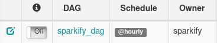
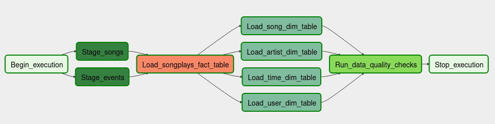

# Project: Data Pipelines with Apache Airflow

## Introduction

A music streaming company, Sparkify, has decided that it is time to introduce more automation and monitoring to their data warehouse ETL pipelines and come to the conclusion that the best tool to achieve this is Apache Airflow.

They have decided to bring you into the project and expect you to create high grade data pipelines that are dynamic and built from reusable tasks, can be monitored, and allow easy backfills. They have also noted that the data quality plays a big part when analyses are executed on top the data warehouse and want to run tests against their datasets after the ETL steps have been executed to catch any discrepancies in the datasets.

The source data resides in S3 and needs to be processed in Sparkify's data warehouse in Amazon Redshift. The source datasets consist of JSON logs that tell about user activity in the application and JSON metadata about the songs the users listen to.

## Datasets

There are two datasets:

- **Song datasets**: Each file is in JSON format and contains metadata about a song and the artist of that song.

    **Location:** `s3://udacity-dend/song_data`

    **Sample:**

```JSON
{"num_songs": 1, "artist_id": "ARJIE2Y1187B994AB7", "artist_latitude": null, "artist_longitude": null, "artist_location": "", "artist_name": "Line Renaud", "song_id": "SOUPIRU12A6D4FA1E1", "title": "Der Kleine Dompfaff", "duration": 152.92036, "year": 0}
```

- **Log datasets**: The second dataset consists of log files in JSON format generated by this event simulator based on the songs in the dataset above. These simulate activity logs from a music streaming app are based on specified configurations.

    **Location:** `s3://udacity-dend/log_data` <br/>
    **log data JSON path:** `s3://udacity-dend/log_json_path.json`

    **Sample:**

```JSON
{"artist":null, "auth":"Logged In", "firstName":"Walter", "gender":"M", "itemInSession":0, "lastName":"Frye", "length":null, "level":"free", "location":"San Francisco-Oakland-Hayward, CA", "method":"GET", "page":"Home", "registration":1540919166796.0, "sessionId":38,"song":null, "status":200, "ts":1541105830796, "userAgent":"\"Mozilla\/5.0 (Macintosh; Intel Mac OS X 10_9_4) AppleWebKit\/537.36 (KHTML, like Gecko) Chrome\/36.0.1985.143 Safari\/537.36\"", "userId":"39"}
```

## Database Schema

The database schema consist of a star schema optimized for queries on song play analysis. One fact table and four dimensional tables were created as seen below:

### Fact table: songplay

```
root
 |-- start_time: timestamp (nullable = true)
 |-- user_id: string (nullable = true)
 |-- level: string (nullable = true)
 |-- song_id: string (nullable = true)
 |-- artist_id: string (nullable = true)
 |-- session_id: long (nullable = true)
 |-- location: string (nullable = true)
 |-- user_agent: string (nullable = true)
 |-- year: string (nullable = true)
 |-- songplay_id: long (nullable = false)
 ```

### Dimension table: songs

 ```
 root
 |-- song_id: string (nullable = true)
 |-- title: string (nullable = true)
 |-- artist_id: string (nullable = true)
 |-- year: long (nullable = true)
 |-- duration: double (nullable = true)
 ```

### Dimension table: artists

 ```
 root
 |-- artist_id: string (nullable = true)
 |-- artist_name: string (nullable = true)
 |-- artist_location: string (nullable = true)
 |-- artist_latitude: double (nullable = true)
 |-- artist_longitude: double (nullable = true)
 ```

### Dimension table: users

 ```
root
 |-- userId: string (nullable = true)
 |-- firstName: string (nullable = true)
 |-- lastName: string (nullable = true)
 |-- gender: string (nullable = true)
 |-- level: string (nullable = true)
 ```

### Dimension table: time

```
 root
 |-- start_time: timestamp (nullable = true)
 |-- hour: integer (nullable = true)
 |-- day: integer (nullable = true)
 |-- week: integer (nullable = true)
 |-- month: integer (nullable = true)
 |-- year: long (nullable = true)
 |-- weekday: integer (nullable = true)
```

## Project Setup

The project consist of the script below:

```
 root folder
 |-- dags/
        |-- sparkify_airflow_dag.py
 |-- plugins/
        |-- helpers/
                  |-- __init__.py
                  |-- sql_queries.py
        |-- operators/
                  |-- __init__.py
                  |-- data_quality.py
                  |-- load_dimension.py
                  |-- load_fact.py
                  |-- stage_redshift.py
        |-- __init__.py
 |-- create_tables.sql
 |-- README.md
 ```

 The project contains two main folders dags and plugins with plugins having two additional subfolders helpers and operators. All the scripts contained in the various folders can be seen above and have the below description:

- `create_tables.sql` : contains all the sql statements for creating all the tables required for the etl process.
- `sparkify_airflow_dag.py` : is the main script that defines the Directed Acyclic Graphs (dags), it defines the tasks to be executed and their dependencies.
- `stage_redshift.py` : contains the custom `StageToRedShiftOperator` for copying JSON data from Amazon S3 Storage to Staging tables in Amazon Redshift.
- `load_fact.py` : contains the custom `LoadFactOperator` that loads data from the Staging tables to the fact table.
- `load_dimension.py` : contains the custom `LoadDimensionOperator` that loads data from the staging tables to the dimension tables.
- `data_quality.py` : contains the custom `DataQualityOper` that run data quality checks on all tables loaded.
- `sql_queries.py` : contains the sql queries for the ETL data pipeline.

## Run Scripts

To run the script:

1. Make sure you have or have created an Amazon webservice account.
1. Provision an Amazon Redshift Cluster ()
1. Login to the Amazon Redshift Console to make sure you are able to connect to the `dev` database.
1. Install Apache Airflow on your local if you do not have it available on your local computer . Note the version used for this project is Version : 1.10.2
1. use the command `git clone git@github.com:donjude/data-pipelines-with-airflow.git` into the airflow home repository. Make sure the files are displayed in the home repository as seen in the file struture above.
1. depending on your airflow configuration you can start airflow using the below in Linux terminal:
   `$ /opt/airflow/start.sh` or
   `$ airflow webserver` to start the webserver, once it has started run `$ airflow scheduler` in a new terminal to start the scheduler.
1. Once the airflow webserver and scheduler has started your dags would be loaded as seen below:

    

    

### Add Airflow Connections

Here, we'll use Airflow's UI to configure your AWS credentials and connection to Redshift.

1. To go to the Airflow UI:

    - You can use the Project Workspace here and click on the blue Access Airflow button in the bottom right.
    - If you'd prefer to run Airflow locally, open <http://localhost:8080> in Google Chrome (other browsers occasionally have issues rendering the Airflow UI).

2. Click on the Admin tab and select Connections.

3. Under Connections, select Create.

4. On the create connection page, enter the following values:
    - Conn Id: Enter aws_credentials.
    - Conn Type: Enter Amazon Web Services.
    - Login: Enter your Access key ID from the IAM User credentials you downloaded earlier.
    - Password: Enter your Secret access key from the IAM User credentials you downloaded earlier.

    Once you've entered these values, select Save and Add Another.

    On the next create connection page, enter the following values:
        Conn Id: Enter redshift.
        Conn Type: Enter Postgres.
        Host: Enter the endpoint of your Redshift cluster, excluding the port at the end. You can find this by selecting your cluster in the Clusters page of the Amazon Redshift console. See where this is located in the screenshot below. IMPORTANT: Make sure to NOT include the port at the end of the Redshift endpoint string.
        Schema: Enter dev. This is the Redshift database you want to connect to.
        Login: Enter awsuser.
        Password: Enter the password you created when launching your Redshift cluster.
        Port: Enter 5439.

    Once you've entered these values, select Save.

Awesome! You're now all configured to run Airflow with Redshift.

3. execute the below code in the bash shell to run the etl process.
4. execute the below code in the bash shell to run the etl process.
5. execute the below code in the bash shell to run the etl process.
6. execute the below code in the bash shell to run the etl process.
